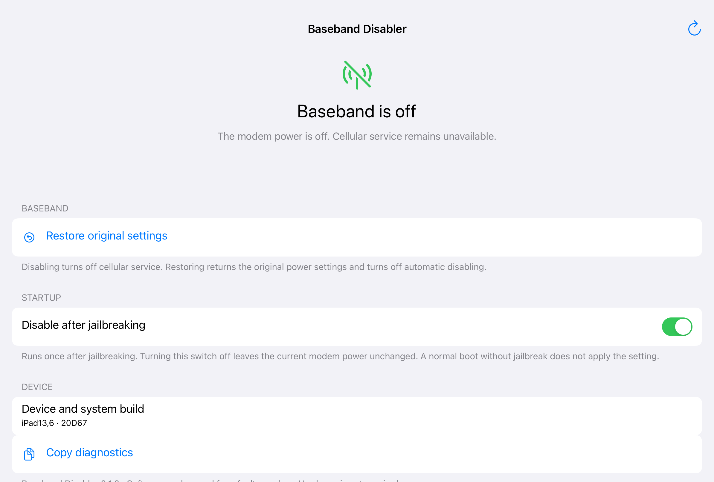

# Baseband Disabler

在 Dopamine 越狱环境下关闭故障基带，减少基带重试造成的待机耗电。提供桌面应用，可一键屏蔽、恢复供电、设置越狱后自动屏蔽，以及复制诊断信息。

**0.1.2 仅支持已实测的 iPad13,6、iPadOS 16.3.1（20D67）。** 型号、系统构建或驱动布局不匹配时拒绝改变供电；未检测到对应基带故障时也拒绝屏蔽。此插件不能修复 eSIM 或基带硬件，屏蔽期间蜂窝网络停用。



## 安装与使用

0.1.2 修复了基带已经断电、驱动后来报告“故障”（11）时，重复屏蔽被拒绝、界面错误显示尚未关闭的问题。仅在 PMU 供电关闭、驱动供电标记为零、防反向供电 GPIO 为输入且逻辑状态为已验证的 1 或 11 时确认关闭。重复屏蔽仍校验本次启动的恢复记录及原有操作前置条件；不会为了清除报错重新给基带上电。

0.1.1 移除了系统设置中的入口和对应组件。升级后由包管理器清除 0.1.0 安装的设置文件；如果系统设置仍显示缓存中的旧项目，关闭并重新打开系统设置。

1. 下载 [0.1.2 安装包](https://github.com/DCMMC/BasebandDisabler/raw/refs/heads/main/dist/com.dcmmc.basebanddisabler_0.1.2_iphoneos-arm64.deb)，在已越狱设备上使用 Filza 安装。需要 rootless 环境和 `uikittools`。
2. 打开桌面的 **Baseband Disabler**。
3. 点击“屏蔽故障基带”。完成后页面显示“基带已关闭”，并自动开启“越狱后自动屏蔽”。

全新安装默认不改变基带供电，自动屏蔽关闭。页面随系统语言使用简体中文或英文，无需在应用里输入 root 密码。

“越狱后自动屏蔽”只控制下次启动任务。关闭开关不会恢复当前供电；要恢复，请点击“恢复原来的设置”，该操作同时关闭自动屏蔽。自动任务在越狱启动后延迟 5 秒执行一次，随后退出。

命令行安装可在 root 终端执行：

```sh
dpkg -i com.dcmmc.basebanddisabler_0.1.2_iphoneos-arm64.deb
```

## 恢复与卸载

点击“恢复原来的设置”会恢复本次启动保存的供电、引脚、唤醒配置及原来的故障状态。恢复供电后，硬件故障仍然存在。

正常卸载会先关闭启动任务并尝试恢复，恢复失败则中止卸载。若缺少本次启动的恢复记录，先关闭自动屏蔽，再完整重启设备，使硬件回到默认供电状态；重新越狱后再检查或卸载。

未越狱的正常启动不会应用屏蔽。已验证安装时启动任务加载成功，**尚未执行整机重启及重新越狱测试**。

此前在这台设备上安装过临时诊断方案时，安装脚本会迁移恢复记录与自动屏蔽设置，并停用旧的启动任务。旧任务的 plist 保留为 `.basebanddisabler-backup`，避免两套任务同时控制基带。

## 实机验证

同一故障设备、同一供电控制后端的锁屏断电对照如下。短测使用电流样本中位数；长测使用累计容量变化，两个指标不能直接混为一谈。

| 测试 | 结果 |
| --- | --- |
| 短测，原供电状态 | 电流中位数 577 mA |
| 短测，关闭故障基带 | 电流中位数 75 mA |
| 短测，恢复供电 | 电流中位数 348 mA，恢复已验证 |
| 后续约 65.7 分钟未接电、锁屏熄屏观察 | 电量 47% → 46%；有效容量样本覆盖约 59.7 分钟，下降 88 mAh，折算平均约 88.4 mA |
| 关闭后的唤醒记录 | 最后一条基带唤醒之后的 30 次系统唤醒中，基带唤醒为 0 |

这些结果来自一台已存在基带硬件故障的设备，不能预测其他设备的耗电。短测的 PowerLog 时间戳有偏差，因此没有采用其按时间范围统计的唤醒次数；上述唤醒结果使用后续记录序号核对。

插件版本已实测安装、恢复供电、重新屏蔽、状态读取与自动开关。诊断信息分别记录物理供电状态与 `driver_state`，避免把逻辑故障状态当作供电证明。0.1.2 已在真实的“逻辑故障 11、实际断电”状态下验证重复屏蔽成功，并验证恢复供电后可以再次屏蔽，最终基带保持关闭。桌面界面已验证。安装包的 7 项检查覆盖文件权限、签名哈希、启动任务、桌面应用、设置组件的排除和私有运行数据的排除。

## 工作方式

权限工具先校验型号与系统构建，再校验驱动布局、供电描述符、PCI 服务、GPIO 引脚及已有的 panic 策略。它短暂清除驱动的“未找到基带”数据标记，调用系统驱动完整的断电流程，立即还原标记，再核对 PMU 供电、驱动状态和防反向供电引脚。成功后退出，失败时尝试恢复原状态。

此实现使用 Dopamine 的内核数据读写接口，不依赖内核函数调用能力。没有常驻轮询任务。新增设备配置需要单独分析和实机验证，不能只放宽型号检查或替换系统版本号。

桌面应用通过固定路径启动权限工具。只有 `basebandctl` 使用 setuid root；允许 root 和 mobile 用户执行固定命令，不接受任意程序、文件路径或内核地址。恢复记录和配置保存在 root 私有目录，操作使用互斥锁。可复制的诊断信息只包含型号、系统构建、供电及配置状态、后端退出码和插件版本。

## 构建

需要支持 iOS arm64 的 Clang、iPhoneOS 16.5 SDK、Python 3.9 或更新版本、`ldid`、`dpkg-deb` 和 Make。默认 SDK 位于相邻的 `theos/sdks/iPhoneOS16.5.sdk`，也可显式指定：

```sh
make check SDK=/path/to/iPhoneOS16.5.sdk
```

`make package` 只构建安装包；`make check` 同时编译供电判断的回归断言并检查实际 `.deb`。产物放在 `dist/`。SDK、越狱运行库、设备恢复记录、密码和原始诊断日志不包含在仓库或安装包中。

| 路径 | 内容 |
| --- | --- |
| `Sources/App` | UIKit 界面与权限工具通信 |
| `Sources/Helper` | 命令分发和 20D67 设备配置 |
| `Resources` | 图标、简体中文及英文文本、签名权限和 bundle 元数据 |
| `packaging` | rootless 安装、卸载和单次启动任务 |
| `scripts` | 资源生成与签名打包 |
| `tests` | 供电判断回归断言与实际安装包检查 |

## 命令行控制

在越狱环境下以 mobile 或 root 用户执行以下命令，返回 JSON；`disable` 成功后会开启自动屏蔽：

```sh
/var/jb/usr/libexec/basebanddisabler/basebandctl status
/var/jb/usr/libexec/basebanddisabler/basebandctl disable
/var/jb/usr/libexec/basebanddisabler/basebandctl restore
/var/jb/usr/libexec/basebanddisabler/basebandctl auto on
/var/jb/usr/libexec/basebanddisabler/basebandctl auto off
```
